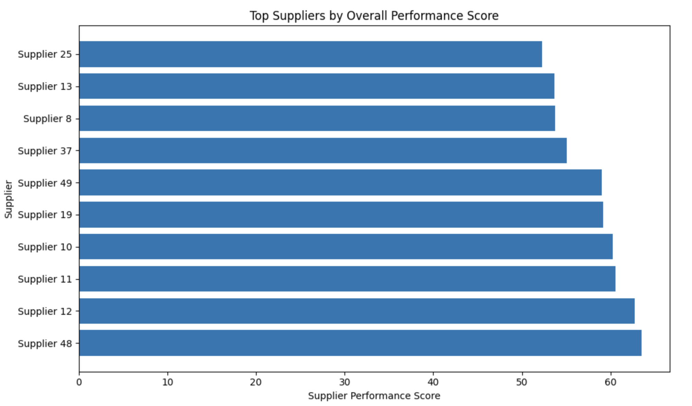
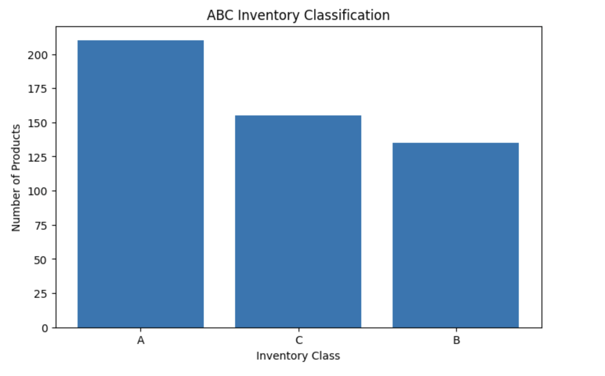
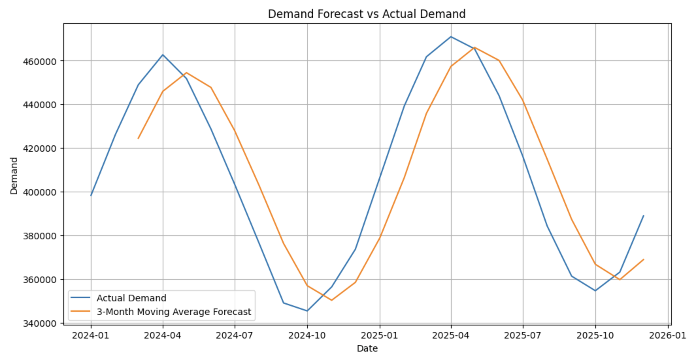

# Supply Chain Analytics Platform

## Project Overview

This project demonstrates end-to-end supply chain analytics using Python. The analysis focuses on supplier performance evaluation, inventory classification, and demand forecasting to support data-driven supply chain decision-making.

The project was developed as part of my transition into Supply Chain Analytics, combining my professional supply chain experience with data analytics techniques learned during my MSc in Business Analytics.

---

## Business Objectives

The project addresses three common supply chain challenges:

1. Supplier performance evaluation
2. Inventory prioritisation using ABC analysis
3. Demand forecasting for inventory planning

---

## Technologies Used

- Python
- Pandas
- NumPy
- Matplotlib
- Google Colab
- GitHub

---

## Skills Demonstrated

- Supply Chain Analytics
- Procurement Analytics
- Inventory Optimisation
- ABC Classification
- Demand Forecasting
- Supplier Performance Evaluation
- Python
- Pandas
- Matplotlib
- Git & GitHub

---
  
## Dataset Overview

The project uses four datasets:

| Dataset | Description |
|----------|-------------|
| suppliers.csv | Supplier performance metrics |
| purchase_orders.csv | Procurement and order records |
| inventory.csv | Inventory stock information |
| demand_history.csv | Historical demand data |

---

## Analysis Conducted

### 1. Supplier Performance Analysis

A supplier performance score was developed using:

- On-time delivery performance
- Quality ratings
- Lead time reliability

The analysis identifies the highest-performing suppliers and highlights supplier management opportunities.

### Key Insight

Several suppliers achieved performance scores above 60, indicating strong reliability and delivery performance.

---

### 2. Inventory Classification (ABC Analysis)

ABC analysis was performed to classify inventory according to inventory value.

| Class | Management Priority |
|---------|-------------------|
| A | High-value inventory requiring close monitoring |
| B | Moderate-value inventory |
| C | Low-value inventory requiring basic controls |

### Key Findings

| Class | Products | Inventory Value |
|---------|----------|----------------|
| A | 210 | £35.17M |
| B | 135 | £6.64M |
| C | 155 | £2.21M |

Category A products account for the majority of inventory value and therefore require tighter inventory control and replenishment monitoring.

---

### 3. Demand Forecasting

A 3-month moving average forecasting model was developed using historical demand data.

### Key Findings

- Demand displays seasonal patterns.
- Forecast values closely follow overall demand trends.
- Moving average forecasting provides a practical baseline planning tool.

---

## Visualisations

### Supplier Performance Analysis



---

### ABC Inventory Analysis



---

### Demand Forecasting



---

## Business Impact

This project demonstrates how data analytics can support:

- Supplier relationship management
- Inventory optimisation
- Procurement planning
- Demand forecasting
- Operational decision-making

---

## Repository Structure

```text
data/
├── suppliers.csv
├── purchase_orders.csv
├── inventory.csv
├── demand_history.csv

data/notebooks/
├── supplier_performance_analysis.ipynb

data/visuals/
├── supplier_performance.png
├── abc_inventory_analysis.png
├── demand_forecast.png
```

---

## Author

Muhammad Ahmed Shoaib

MSc Business Analytics
Queen's University Belfast

Interested in Supply Chain Analytics, Procurement Analytics, Inventory Optimisation, and Data-Driven Decision Making.
